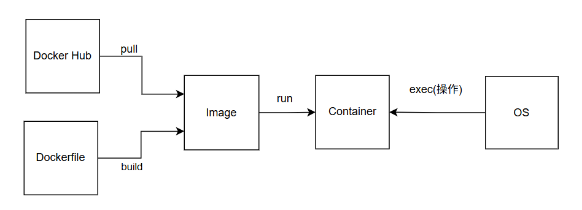

## 仕組み
このレポジトリではDockerを用いてtex執筆環境を構築したコンテナーを作成しました。  
これにより環境構築の手間が省け、ローカルPCも汚れません。  
ここではレポジトリがどのようにして機能しているかを説明します。

  

コンテナーは新たなパソコンを作るというイメージです。コンテナーはすぐに作ったり消したりすることが可能なので気軽にtexなどを導入できます。（ミスしたら消してまた作成するだけです）しかしコンテナーを作るにはDocker Engine、Docker Engineを動かすにはLinux(WSL)が必要です。よってDocker Desktopをダウンロードする必要があります。Docker DesktopはDocker EngineやLinux(WSL)、Docker Composeなどをまとめてインストールしてくれます。VS Codeはエディターです。ファイルの編集がしやすくなります。（誤字チェックや文法チェックなどさまざまな機能を追加できるのでメモ帳の完全上位互換です）

VS CodeのRemote DevelopmentのDev Containers機能は .devcontainerフォルダーのdevcontainer.json を元にコンテナの起動方法を決定します。docker-compose.yml を使う場合はこのファイルを参照するよう devcontainer.json に設定することでDocker Compose経由でコンテナが作成されます。（Docker Composeがdocker-compose.ymlファイルを読み込んでDocker Engineにコンテナー作成の指示を出します）Docker EngineはDockerfileをビルドしてイメージをつくってイメージからコンテナーを作成します。また、ホストPCのファイルをマウントします。Dockerfileはどのような環境を備えたコンテナーを作るかをコードとして書けます。これによりだれでも同じコンテナーが作れるというわけです。また、Dockerfileを書き換えるだけでいろいろな環境も作れてしまいます。（Dockerについて学ばないと腑に落ちないと思うので興味がある人はDockerを学ぶといいと思います）

Remote DevelopmentのDev Containers機能はコンテナ内でVS Code(Server)を起動し、ホストのVS Code(UI)がそのサーバーへ接続することで実際の処理（ビルド・補完・ターミナル操作など）をコンテナ内で行います。これはPCでブラウザを見るときと同じ仕組みです。（コンテナ内のVS Code(Server)とホストのVS Code(UI)はDocker Engineによって管理されるコンテナ上で動作しソケット通信または内部ネットワークで接続されます）

.latexmkrcはlatexmkの設定ファイルです。latexmk実行時に読み込まれ、コンパイル方法やオプション、デフォルト動作などを自動適用できます。latexmkは設定ファイルをホームディレクトリで探すのでコンテナ内のデフォルトホームディレクトリ/root/にマウントしました。

.vscodeはVS Codeワークスペースごとの設定ディレクトリです。ワークスペース固有のエディタ設定などができます。

説明は以上です。わからないところを調べつつこのリポジトリのコードを読むと自力でオリジナルな機能を追加できると思います。

